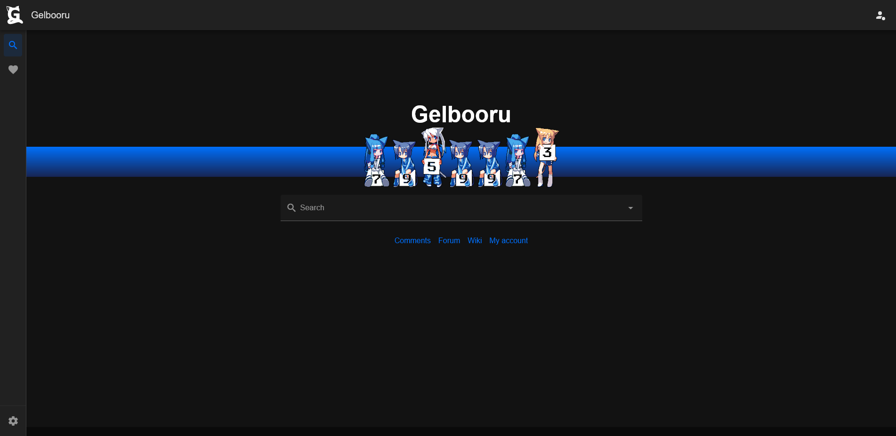
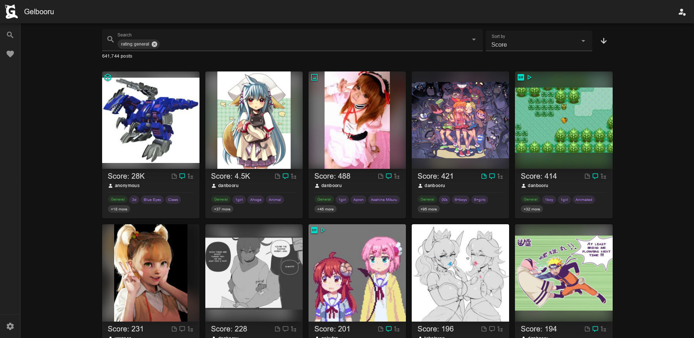
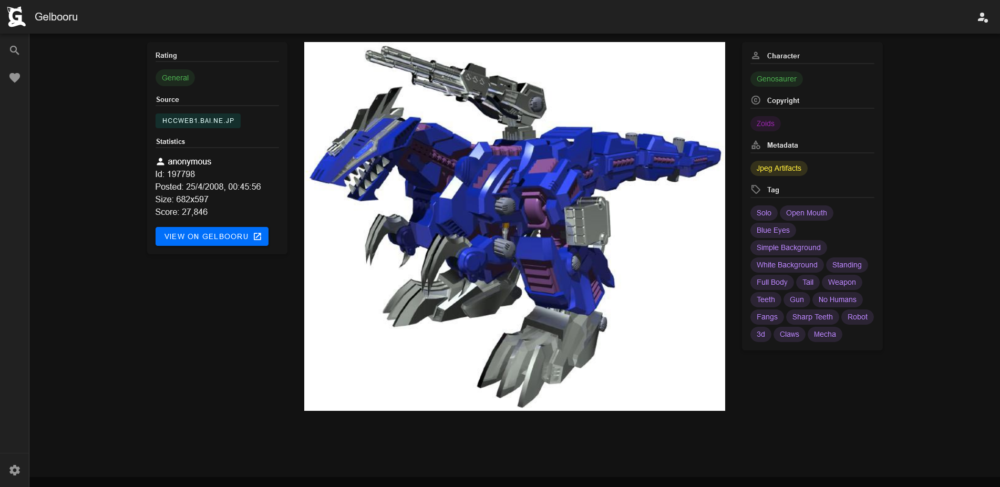

# Gelbooru Nuxt
Unofficial Gelbooru client using Nuxt, Vuetify, Tailwind and Pinia. Using Gelbooru's official API.

## ✔ Features
- 🚀 SSR
- 🖌 Material design
- 📱 Mobile friendly
- ⚙ User customization

## ⚠ Caveats
- The authentication is not real authentication, the API doesn't have a real way to verify it.

## 👩‍💻 Setup Dev

Make sure to install the dependencies:

```bash
# yarn
yarn install

# npm
npm install

# pnpm
pnpm install
```

### Development Server

Start the development server on `http://localhost:3000`

```bash
npm run dev
```

## 🚀 Production (Docker)

With docker compose:
```bash
# build image
docker compose build

# run
docker compose up -d
```

## 📷 Screenshots




