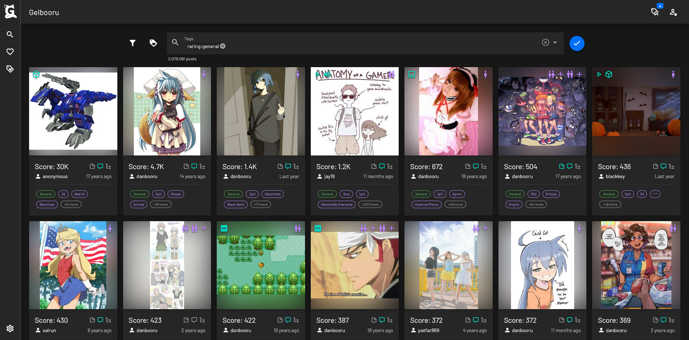

# Gelbooru Nuxt
Unofficial Gelbooru client using Nuxt, Quasar, Tailwind and Pinia. Using [Gelbooru's official API](https://gelbooru.com/index.php?page=wiki&s=view&id=18780).

## ✔ Features
- 🚀 SSR
- 🖌 Material design
- 📱 Mobile friendly
- ⚙ User customization

## ⚠ Caveats
- The authentication is not real authentication, the API doesn't have a real way to verify it.

## 👩‍💻 Setup Dev

Make sure to install the dependencies:

```bash
bun install
```

### Development Server

Start the development server on `http://localhost:3000`

```bash
bun run dev
```

## 🚀 Production (Docker)

With docker compose:
```bash
# build image
docker compose build

# run
docker compose up -d

# one line
docker compose up -d --build
```

## 📷 Screenshots
### Home page


### Search results page


### Post details page


### Saved searches
